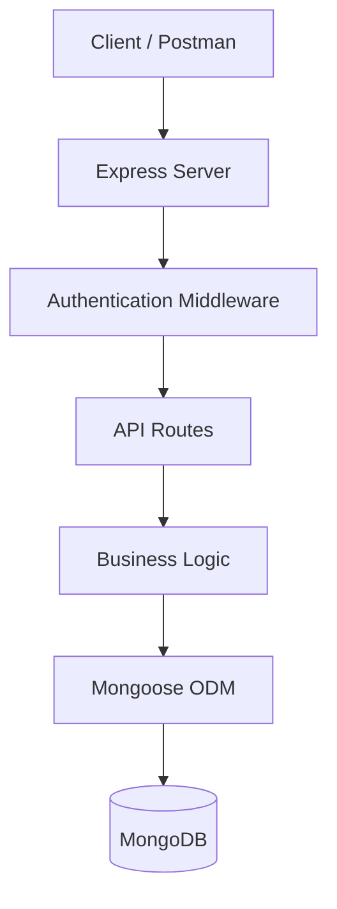
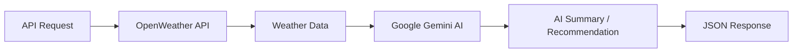
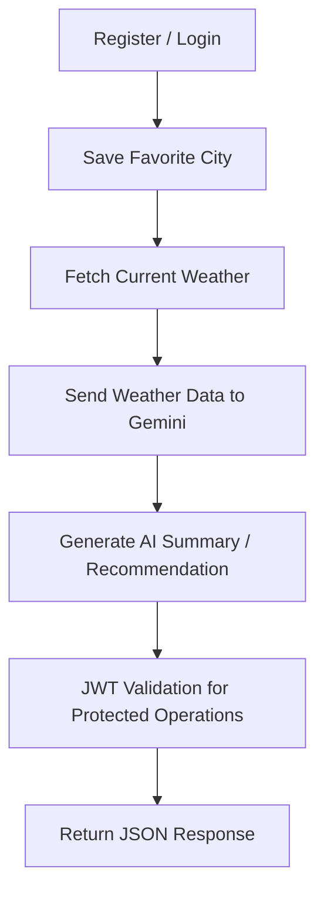

# 🌦️ AI WeatherWise

## Deliver Intelligent Weather Forecasts and Insights

AI WeatherWise is a RESTful backend platform built using **Node.js** and **Express.js**. It uses **MongoDB** with **Mongoose ODM** for data persistence and integrates real-time weather information with **Google Gemini AI** to provide intelligent weather summaries and personalized recommendations.

The platform includes authentication, favorite-location management, external weather integration, AI-powered insights, request sanitization, centralized error handling, and fallback behavior for external-service failures.

---

## ✨ Features

* User registration and login
* JWT-based authentication
* Password hashing using bcrypt/bcryptjs
* Favorite location management
* Current weather retrieval
* OpenWeather API integration
* Google Gemini AI integration
* AI-generated weather summaries
* Personalized activity recommendations
* Clothing recommendations
* Travel advice
* Role-based route protection
* Request sanitization
* Centralized error handling
* Fallback behavior when external services are unavailable
* MongoDB persistence using Mongoose

---

## 🎯 Project Use Case

AI WeatherWise is designed for users who frequently visit different cities and need a convenient way to understand current weather conditions.

### Example Scenario

Alex is a travel enthusiast who frequently visits different cities.

Alex needs:

* Current weather information
* Favorite city management
* Natural-language weather summaries
* Personalized outdoor activity recommendations
* Clothing suggestions
* Secure synchronization of preferences

AI WeatherWise combines weather data with Google Gemini AI to provide more understandable and personalized weather insights.

---

# 🏗️ Architecture

## High-Level Architecture



### Architecture Flow

**Client / Postman**

↓

**Express Server**

↓

**Authentication Middleware**

↓

**API Routes**

↓

**Business Logic**

↓

**Mongoose ODM**

↓

**MongoDB**

---

## 🌤️ Weather & AI Flow



The weather workflow retrieves current weather information and uses Google Gemini AI to generate intelligent summaries and personalized recommendations.

---

# 🧩 MVC Architecture

AI WeatherWise follows an MVC-oriented architecture.

### Model

The Model layer manages the application's data structure and persistence.

Responsibilities include:

* Mongoose schemas
* User entity
* Location entity
* Database persistence

### Controller

The Controller layer manages application logic.

Responsibilities include:

* Business/application logic
* Request processing
* Weather and AI orchestration
* JSON responses

### View / Routing Layer

AI WeatherWise is a headless backend application.

Instead of traditional server-rendered views, the **API routing layer acts as the interface** between clients and the application logic.

---

# 🛠️ Technology Stack

| Category          | Technology                       |
| ----------------- | -------------------------------- |
| Backend           | Node.js                          |
| Web Framework     | Express.js                       |
| Database          | MongoDB                          |
| ODM               | Mongoose                         |
| Weather Service   | OpenWeather API                  |
| AI Service        | Google Gemini AI                 |
| Authentication    | JWT                              |
| Password Security | bcrypt/bcryptjs                  |
| Configuration     | dotenv / `.env`                  |
| Development       | Visual Studio Code, npm, Nodemon |
| API Testing       | Postman, Thunder Client          |

---

# 🗄️ Database Design

AI WeatherWise uses MongoDB for data persistence and Mongoose for schema-based data modeling.

## User Entity

| Field      | Description      |
| ---------- | ---------------- |
| `_id`      | MongoDB ObjectId |
| `name`     | User name        |
| `email`    | User email       |
| `password` | Hashed password  |
| `role`     | User role        |

## Location Entity

| Field       | Description       |
| ----------- | ----------------- |
| `_id`       | MongoDB ObjectId  |
| `user`      | Reference to User |
| `city`      | Favorite city     |
| `country`   | Country           |
| `createdAt` | Creation date     |

### Relationship

```text
User
  |
  | 1
  |
  | *
  ↓
Location
```

**One User → Many Locations**

A registered user can save multiple favorite locations.

---

# 🔐 Security

AI WeatherWise includes multiple security mechanisms.

### JWT Authentication

JWT is used to authenticate protected API operations.

### Password Hashing

User passwords are protected using bcrypt/bcryptjs hashing.

### Protected Routes

Protected operations require appropriate authentication.

### Environment Variables

Sensitive configuration values are stored through environment variables rather than being hard-coded into application source code.

### Request Sanitization

Request sanitization helps protect against unwanted input and NoSQL parameter manipulation.

### Role-Based Route Guarding

Role-based protection is used for guarded resources.

### Centralized Error Handling

Centralized error handling provides controlled responses when application or service errors occur.

---

# 📁 Project Structure

The currently documented project-level structure includes:

```text
AI-WeatherWise/
├── index.js
├── package.json
├── .env
├── .env.example
├── .gitignore
└── ...
```

Additional implementation folders and files are represented by `...` because they are not specified in the supplied project information.

---

# ⚙️ Installation

## 1. Create the Project

Create a project folder named:

```text
AI Weatherwise
```

Open the project in **Visual Studio Code**.

---

## 2. Initialize Node.js

```bash
npm init -y
```

---

## 3. Install Dependencies

```bash
npm install express mongoose bcryptjs jsonwebtoken cors dotenv multer @google/genai
```

---

## 4. Install Nodemon

```bash
npm install --save-dev nodemon
```

---

# 🔑 Environment Configuration

Create a `.env` file in the project root.

Use only safe placeholder values:

```env
PORT=5000
MONGO_URI=your_mongodb_connection_string
JWT_SECRET=your_jwt_secret
GEMINI_API_KEY=your_gemini_api_key
OPENWEATHER_API_KEY=your_openweather_api_key
```

### Important Security Rule

**Never commit real credentials to GitHub.**

Do not expose:

* MongoDB passwords
* JWT secrets
* Gemini API keys
* OpenWeather API keys

Use `.env.example` with placeholder values for sharing configuration requirements.

---

# ▶️ Running the Project

Install project dependencies:

```bash
npm install
```

Start the backend:

```bash
npm start
```

The documented server port is:

```text
5000
```

The backend connects to MongoDB and then listens for incoming API requests.

---

# 🔌 API Functional Areas

The project documentation identifies the following functional areas.

## Authentication

Provides:

* User registration
* User login
* Authenticated-user operations

Authentication uses JWT and password hashing.

---

## Weather

Provides current weather information for a requested city through the OpenWeather integration.

---

## Favorites

Provides favorite-location management, including:

* Creating favorite locations
* Retrieving favorite locations
* Deleting favorite locations

---

## AI Recommendations

Google Gemini AI is used to provide:

* Weather summaries
* Personalized recommendations
* Activity suggestions
* Clothing suggestions
* Travel advice

> Exact API endpoint paths are intentionally not listed here because they were not provided in the supplied project information.

---

# 🔄 User Flow



### Flow Explanation

1. User registers or logs in.
2. User saves a favorite city.
3. User requests current weather.
4. Weather information is processed for AI insights.
5. Gemini generates a summary or recommendation.
6. Protected operations are validated through JWT.
7. The system returns the requested JSON response.

---

# 🧪 API Testing

The backend can be tested using:

* **Postman**
* **Thunder Client**
* **PowerShell**

## Recommended Testing Flow

```text
1. Register
      ↓
2. Login
      ↓
3. Obtain JWT
      ↓
4. Test Protected Operations
      ↓
5. Fetch Weather
      ↓
6. Request AI Recommendations
      ↓
7. Test Favorite Locations
      ↓
8. Verify API Health
```

### Screenshot Placeholders

> Replace these placeholders with actual screenshots from the project.

```text
[Insert Register API Screenshot Here]
```

```text
[Insert Login API Screenshot Here]
```

```text
[Insert Weather API Screenshot Here]
```

```text
[Insert Recommendation API Screenshot Here]
```

---

# 🛡️ Fallback Handling

AI WeatherWise is designed with fallback behavior for external-service failures.

### Weather Service Failure

External weather-service failure should not crash the backend.

The system can use fallback behavior when the external weather service or required credentials are unavailable.

### Gemini Failure

If Gemini is unavailable, the core weather functionality should remain available.

The AI portion can indicate that AI functionality is unavailable while the weather service continues operating.

### Objective

The fallback approach improves the resilience of the application and prevents external-service failures from bringing down the complete backend.

---

# 🧑‍💻 Development & Troubleshooting

During development, several integration and configuration issues were encountered.

### MongoDB Authentication / Connection

MongoDB authentication and connection configuration required troubleshooting during development.

### Weather Data Integration

Weather data display and integration required troubleshooting to ensure the backend returned the expected weather information.

### AI Recommendation Route

A route/method mismatch was encountered during AI recommendation testing, resulting in:

```text
Cannot GET
```

This indicated that the requested HTTP method or route did not match the registered API route.

### Root Route

Testing the root URL produced:

```text
Cannot GET /
```

This indicates that a root route was not registered for that path.

### Nodemon Startup

A development startup displayed a duplicated:

```text
index.js index.js
```

This required checking the Nodemon command or npm script configuration.

### Environment Protection

Environment variables and secret protection were addressed through `.env` configuration and `.gitignore`.

---

# 📦 Development Workflow

```mermaid
flowchart LR
    A[Create Project] --> B[Initialize Node.js]
    B --> C[Install Dependencies]
    C --> D[Configure Environment]
    D --> E[Connect MongoDB]
    E --> F[Implement Backend]
    F --> G[Integrate OpenWeather]
    G --> H[Integrate Gemini AI]
    H --> I[Add Authentication & Security]
    I --> J[Test APIs]
    J --> K[Debug & Verify]
```



---

# 🚀 Future Enhancements

The following are **proposed enhancements**, not claims about currently implemented functionality:

* Additional weather information and forecasting capabilities
* More advanced AI-generated weather insights
* Expanded personalization options
* Additional weather-related analytics
* More extensive API monitoring
* Additional client interfaces
* Improved visualization of weather information

---

# 📌 Project Highlights

| Area                    | Implementation            |
| ----------------------- | ------------------------- |
| Backend                 | Node.js + Express.js      |
| Database                | MongoDB + Mongoose        |
| Weather                 | OpenWeather API           |
| Artificial Intelligence | Google Gemini AI          |
| Authentication          | JWT                       |
| Password Security       | bcrypt/bcryptjs           |
| API Testing             | Postman / Thunder Client  |
| Configuration           | Environment variables     |
| Resilience              | External-service fallback |
| Architecture            | MVC-oriented REST API     |

---

# 🎓 Project Purpose

AI WeatherWise demonstrates how modern backend technologies, external APIs, database persistence, authentication, and Generative AI can be combined to create an intelligent weather-information platform.

The project provides a practical example of integrating:

```text
REST APIs
    +
MongoDB
    +
OpenWeather
    +
Google Gemini AI
    +
JWT Security
    =
AI WeatherWise
```

---

# 📄 Project Documentation

For project demonstrations and academic presentations, the README can be used together with the project's technical documentation and presentation.

---

# ⚠️ Security Notice

Never publish actual credentials in this repository.

Before pushing the project to GitHub, make sure:

```text
.env
```

is excluded from Git tracking.

Use:

```text
.env.example
```

for safe configuration placeholders.

---

# 🌦️ AI WeatherWise

### Deliver Intelligent Weather Forecasts and Insights

Built with **Node.js • Express.js • MongoDB • OpenWeather • Google Gemini AI**
